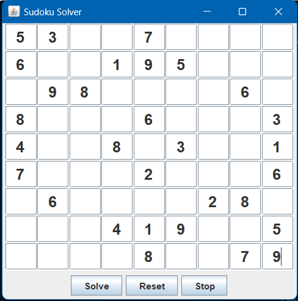
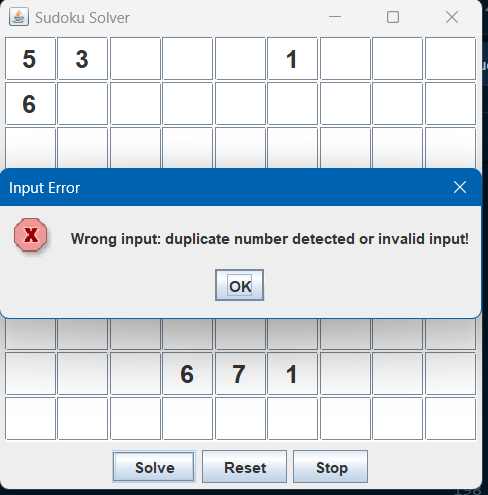
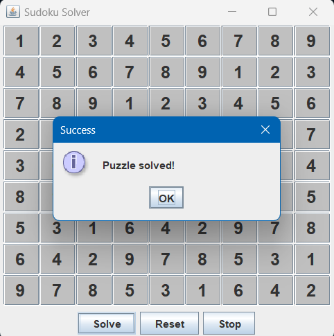

<h1 align="center">Sudoku Solver</h1>

  <em>Visualizing Foundational DSA Algorithms such as <b>Backtracking<b> and <b>Recursion<b> through a familiar game Sudoku.</em>

  

A user-friendly **Sudoku Solver** built in Java that uses **Backtracking and Recursion** to solve 9x9 Sudoku puzzles. The application features an interactive GUI with real-time algorithm visualization, allowing users to watch the solving process step by step.

## 📌 Features

- 🔢 **9x9 Sudoku Grid** using `JTextField[][]`
- 🎨 **Visual Solver**: Watch each step of the backtracking process with color-coded feedback
- 🧠 **Algorithm**: Uses recursive backtracking for solving
- 🎛️ **Interactive Buttons**: 
  - `Solve`: Starts the solving process
  - `Reset`: Clears the board
  - `Stop`: Halts the solving mid-way
- 📥 **Custom Input Support**: Fill in your own puzzle
- ⚠️ **Validation**: Alerts for invalid or unsolvable inputs
- 🔄 **Multithreading**: Keeps GUI responsive during solving

## Technologies Used

- **Java**
- **Java Swing (javax.swing)** for GUI
- **java.awt & java.awt.event** for UI styling and event handling
- **Multithreading** for responsive solving
- **Recursion + Backtracking Algorithm** for solving logic

## How it Works

1. Fill the Sudoku grid manually or leave it blank.
2. Click the **Solve** button to start the process.
3. Watch as numbers are filled and cells are highlighted:
   - `Light Gray`: Current cell being tested
   - `White`: Cell cleared during backtracking
4. Use the **Stop** button anytime to halt solving.
5. Get results via popup:
   - ✅ Puzzle Solved!
   - ❌ No Solution Found!
   - ⚠️ Invalid Input!

## Algorithm Overview

### Backtracking with Recursion

- **Try** numbers 1-9 in each empty cell.
- **Validate** if the number satisfies Sudoku constraints (row, column, 3x3 grid).
- **Recurse** to the next cell.
- **Backtrack** if stuck (remove the number and try another).

### Time Complexity

- **Worst Case**: `O(9^81)` – extremely large for puzzles with few clues
- **Average Case**: Much faster due to pruning and pre-filled constraints

## Project Glimpse

### Worng Input alert

### Few stages of Recursive Process

  →  →  →  →  →  →  

### Completion Information

## Educational Value

- Visualizes how backtracking works step-by-step
- Explains recursion clearly through interface updates
- Great for learning algorithms and Java GUI development

## 🔗 Related LinkedIn Post

> ✨ “What began as a mini-project turned into a metro-sized journey.”  
> Read the full story behind building **Delhi Veins** on LinkedIn:  
**[🔗 Click to read](https://www.linkedin.com/posts/diyumana-bhardwaj_dsa-dsainreallife-learnwithfun-activity-7334260088481730560-hkjp?utm_source=share&utm_medium=member_desktop&rcm=ACoAAESuVMMBVZc_3wpWPqClK3GIK4xugcX6uHU)**

---

> ✨ This project is part of an academic submission and is meant for educational purposes. Feel free to contribute or fork!

=======

